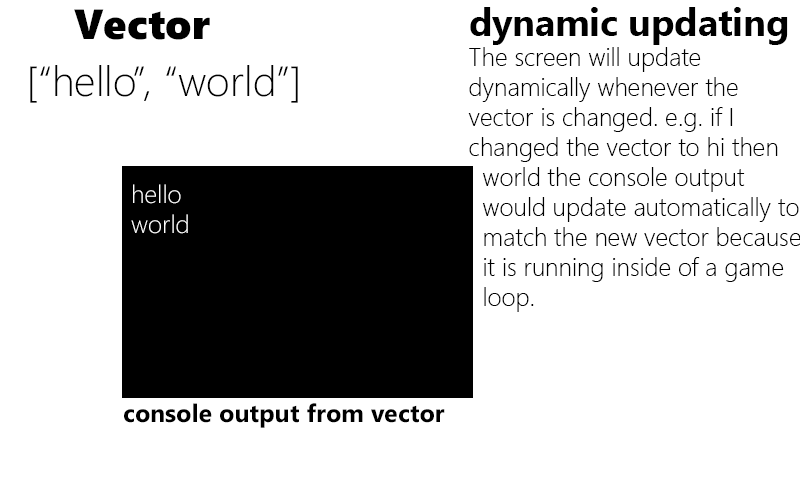

# Sift
## what is sift?
sift is a terminal file manager inspired by the one built into vim

## Vector based console output
> ### what is vector based console output
> vector based console output or VBCO is a method that will be used to control the terminal output on this program. Eatch part of the std::vector\<std::string> represents a line of the console below is an example of the expected terminal output from a vector
> 
